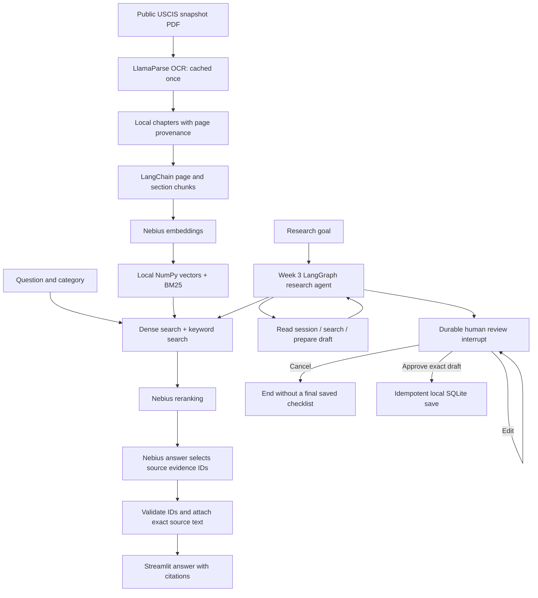

# EB-1 Policy Desk architecture

This standalone Week 3 app opens directly to the research agent. Its four tools reuse the included Week 2 retrieval foundation; it runs independently without checking out another repository.

## Data locations

| Data | Location and handling |
| --- | --- |
| API keys | Local `.env`, loaded by the local application; excluded from Git and the submission ZIP. |
| Source PDFs | Local project folder; selected public pages were sent to LlamaCloud for parsing. Raw PDFs and cloud responses are excluded from the ZIP. |
| Public prepared chapters | `data/corpus/` locally; a reproducible public-only copy is included under `corpus/` in the submission. |
| Embeddings and chunks | `data/index/` on the server; a checked public-only copy in `corpus/index/` makes startup independent of embedding calls. No Pinecone index is needed. |
| Questions and passages | Sent to Nebius for embedding, reranking and generation. This is not fully offline processing. |
| Research drafts and conversations | Local `runtime/checkpoints.sqlite`, retained across app restarts. |
| Approved checklists | Local `runtime/research.sqlite`; final save requires review. |
| Evaluation samples | Public policy questions only, under `evals/`. |

The local Streamlit process binds to `127.0.0.1`. Questions and policy excerpts go to Nebius, while checkpoints and approved checklists stay on the local computer. Files are not additionally encrypted by the app. Local mode retains its stable workspace across restarts. See the README for setup.

## Decisions and limits

- A local brute-force vector store is sufficient for 65 chunks. NumPy stores numeric arrays without pickle; metadata is JSON.
- Dense and BM25 rankings contribute reciprocal ranks using constant 60. The top ten fused candidates are model-reranked, with four supplied to answer generation. A reranker failure falls back to fusion and is visible in the result.
- Chunks target 550 tokens with 70-token overlap, bounded by pages and section headings. Some long tables cross chunks. HTML table headings are retained; citation pages remain stable.
- The model selects source evidence IDs. Code supplies the quoted text and verifies the source reference. This establishes citation integrity, not semantic truth; claim support needs separate evaluation.
- The research planner selects tools through a constrained JSON action schema. It is a single model-driven LangGraph agent, not a fixed chain and not a multi-agent system.
- At most six planning steps and three searches are permitted. API clients retry transient failures once; final save retries SQLite operational errors once, then exposes a retry action. Other tool failures hand off.
- Checkpoint and session-catalog writes happen automatically as internal state persistence. The user-reviewed action is publishing the final checklist into the local approved-checklist table.
- Approval is tied to a SHA-256 digest of the exact draft. Editing removes approval. The save key combines session identity and draft digest to prevent duplicates.
- This is a dated policy research tool. It has no candidate profiling, LinkedIn scraper, legal eligibility score, automated document upload, or letter-writing feature.

Implementation references: [LangGraph interrupts](https://docs.langchain.com/oss/python/langgraph/interrupts), [LangGraph persistence](https://docs.langchain.com/oss/python/langgraph/persistence), [Nebius API](https://docs.tokenfactory.nebius.com/api-reference/examples/overview.md). The implementation is original project code; the Academy solution kit was reviewed as a hint and was not copied.
